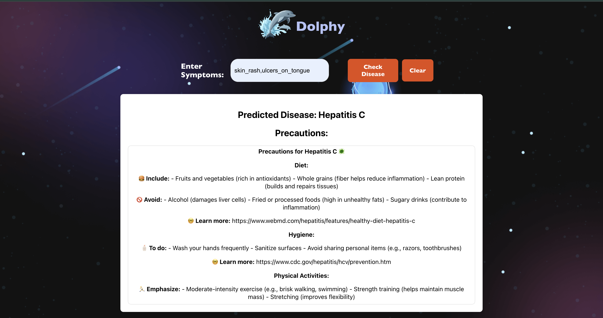

# Dolphy 🐬
Dolphy is an innovative healthcare platform inspired by the dolphin, symbolizing health and well-being in various cultures. It leverages advanced technologies to provide personalized disease prediction and precautionary advice.

## Overview 🚀
Dolphy integrates MindsDB for machine learning model creation and training. Users input symptoms, and Dolphy sends these to a MindsDB model(stored in DOCKER) to deliver accurate disease predictions and precautionary measures. An integrated AI agent powered by Google Gemini provides tailored precautions for identified diseases.

## Features ✨
1. Disease Prediction: Users input symptoms to receive precise disease predictions.
2. Precautionary Advice: Integrated AI agent powered by Google Gemini provides tailored precautions for identified diseases.
3. Technological Stack: Flask serves as the robust backend server, handling data processing and model inference, while React offers a dynamic and responsive user interface.

## Future Enhancements 🌟
1. Advanced AI Integration: Plan to replace Google Gemini with a chatbot trained on MindsDB using LangChain and OpenAI GPT-4 for enhanced interaction and intelligent responses.
2. Enhanced User Experience: Implement features like image recognition and voice input for seamless user interaction and accessibility.

### Quick Insights 👊

The Current Project uses Gemini-pro for text generation. Prompt Engineering is done to provide clear cut precautions for each disease.

## UI Design



## Current Progress
| YouTube Video |
|----------------|
|<a href="https://youtu.be/_97JjadCFOs"></a>

## Getting Started

1. Clone the repository
```bash
git clone https://github.com/Vr978/Dolphy.git
```

2. Navigate to the project directory
```bash
cd dolphy
``` 

3. Add Your Gemini-Api Key
in app.py
```bash
 GOOGLE_API_KEY='YOUR_API_KEY'
```

4. Start the flask app.py and react website
```bash
python app.py
npm start
```

Note : Must have Gemini API key to run the app, you can create [here](https://ai.google.dev/).